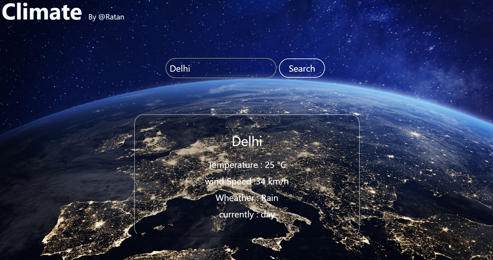

# Weather App 

A simple weather application built using Html, Javascript, Node.js and Tailwind CSS.

## Features
- Search weather by city
- Responsive UI using Tailwind CSS
- Weather data API integration

## Screenshot

## Installation
1. Clone the repo
2. Run `npm install`
3. Run `npm start`

## Tech Stack
- Node.js
- Tailwind CSS
- JavaScript

